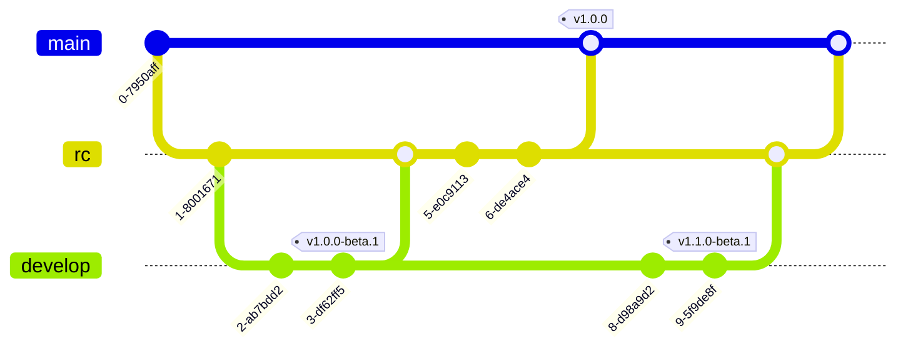

# ecology-netease
生态模组，网易版

## 提交规范

使用 git emoji 提交，格式为: [emoji] message，例如: ✨ 增加生态系统。各个 emoji 的含义如下:
| 类型 | emoji | 文本           | 含义                     |
| ---- | ----- | -------------- | ------------------------ |
| 通用 | 🎉     | :tada:         | 重要更新                 |
|      | 🔖     | :bookmark:     | 版本更新                 |
|      | 🏷     | :label:        | 标签，一般用于发布记录   |
|      | 🔧     | :wrench:       | 更新配置文件             |
|      | ✏     | :pencil2:      | 文档修改                 |
|      | 🎨     | :art:          | 格式化文件               |
|      | 🚚     | :truck:        | 文件移动或重命名         |
| 脚本 | ✨     | :sparkles:     | 新增功能                 |
|      | 🚧     | :construction: | 小功能更新               |
|      | 🐛     | :bug:          | 修复BUG                  |
|      | ♻     | :recycle:      | 重构代码                 |
|      | 💩     | :poop:         | 优化垃圾代码             |
|      | ⚡     | :zap:          | 优化代码(性能方面)       |
|      | 💡     | :bulb:         | 代码添加注释             |
| 资源 | 📑     | :pencil:       | 更新json文档             |
|      | 🍱     | :bento:        | 新增或修改图片等静态资源 |
| 定制 | 📜     | :scroll:       | 增加数据，配方等规则     |
|      | 📖     | :book:         | 增加自定义书籍           |
|      | 📦     | :package:      | 增加方块 block           |
|      | 🌱     | :seedling:     | 增加作物                 |

代码注释中的一些表情含义:
| 表情 | 含义               |
| ---- | ------------------ |
| 🔥    | 核心算法相关的代码 |
| ⚡    | 性能相关的代码     |
| ❗️    | 重要的代码         |

## 分支规范

发布两个版本：beta/正式版，一共三个分支：
- beta：开发功能，上线 beta 版本
- rc: 只增加内容，不可以开发功能
- main: rc 开发完后合并，上线正式版，不开发功能也不增加内容，只合并代码

在 beta 分支上开发功能，完成后发布 beta 版，合并到 rc 增加内容，最后合到 main 发布正式版

