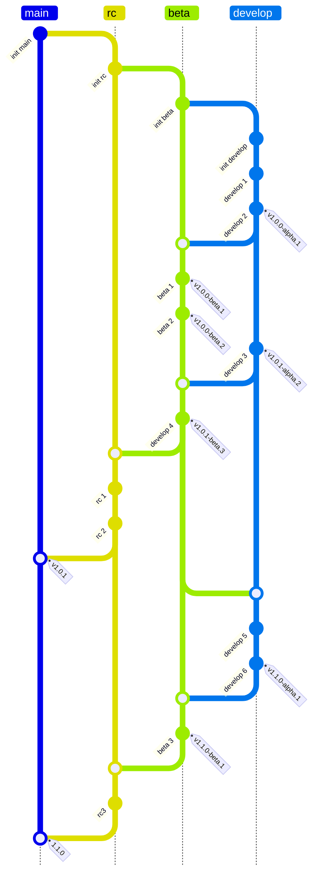

# ecology-netease
生态模组，网易版

## 更新内容

| 版本 | 内容                                     |
| ---- | ---------------------------------------- |
| v1.0 | 生态系统，工作台系统，作物系统，书籍系统 |

## 提交规范

使用 git emoji 提交，格式为: [emoji] message，例如: ✨ 增加生态系统。各个 emoji 的含义如下:
| 类型 | emoji | 文本           | 含义                     |
| ---- | ----- | -------------- | ------------------------ |
| 通用 | 🎉     | :tada:         | 重要更新                 |
|      | 🔖     | :bookmark:     | 版本更新                 |
|      | 🏷     | :label:        | 标签，一般用于发布记录   |
|      | 🔧     | :wrench:       | 更新配置文件             |
|      | ✏     | :pencil2:      | 文档修改                 |
|      | 🎨     | :art:          | 格式化文件               |
|      | 🚚     | :truck:        | 文件移动或重命名         |
| 脚本 | ✨     | :sparkles:     | 新增功能                 |
|      | 🚧     | :construction: | 小功能更新               |
|      | 🐛     | :bug:          | 修复BUG                  |
|      | ♻     | :recycle:      | 重构代码                 |
|      | 💩     | :poop:         | 优化垃圾代码             |
|      | ⚡     | :zap:          | 优化代码(性能方面)       |
|      | 💡     | :bulb:         | 代码添加注释             |
| 资源 | 📑     | :pencil:       | 更新json文档             |
|      | 🍱     | :bento:        | 新增或修改图片等静态资源 |
| 定制 | 📜     | :scroll:       | 增加数据，配方等规则     |
|      | 📖     | :book:         | 增加自定义书籍           |
|      | 📦     | :package:      | 增加方块 block           |
|      | 🌱     | :seedling:     | 增加作物                 |

代码注释中的一些表情含义:
| 表情 | 含义               |
| ---- | ------------------ |
| 🔥    | 核心算法相关的代码 |
| ⚡    | 性能相关的代码     |
| ❗️    | 重要的代码         |

## 分支规范

发布两个版本：beta/正式版，一共四个分支：
| 分支    | 功能             | 合并               |
| ------- | ---------------- | ------------------ |
| develop | 开发功能         | 定期合并 beta 分支 |
| beta    | 添加 beta 版内容 | 合并 develop 分支  |
| rc      | 添加正式版内容   | 合并 beta 分支     |
| main    | 发布正式版       | 合并 rc 分支       |

各分支提交与合并规范如下:

每次发版分大中小三个版本：
- 大版本 v1: 大功能，底层逻辑改进，网易发布新正式版
- 中版本 v1.0: 在大版本基础上改进功能，网易发布新 beta 版
- 小版本 v1.0.0: 部分内容改进，bug修复
- 