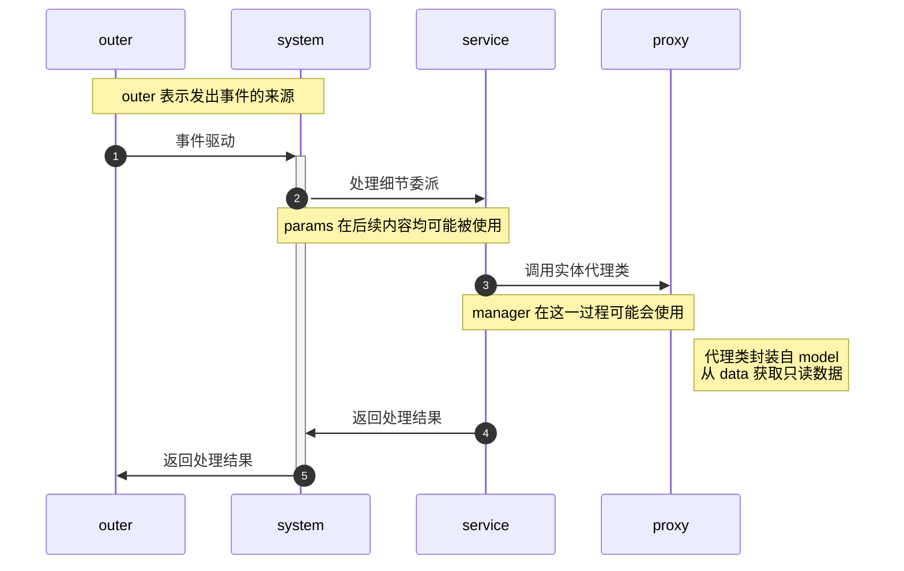

# 项目结构

## 文件结构

```json
|- common // 通用模块，不可以引入其他模块的内容
    |- params // 通用参数
    |- utils // 一些工具
|- ecology // 生态模块/系统
    |- service // 服务端
        |- data // 提供只读数据
        |- entity // 将 data 转换为对象，同时可以作为本模块内的参数
        |- manager // 物品，实体，方块管理类(可选)
        |- proxy // 对 entity 的封装，增加功能
        |- service // system 事件的具体处理逻辑，不可以引入 SDK API，只负责处理数据逻辑
        |- system // 与 client 交互事件的地方，service 只负责拿 SDK API 进行逻辑处理
        |- facade // 该模块向外暴露的一些接口
    |- client // 客户端(可选)
        |- ui // UI
        |- system // 与 system，其他系统交互事件的地方
|- crop // 其他模块系统
|- __init__.py
|- modConfig.py // 全局配置文件
|- modMain.py // 项目入口文件
```

`__init__.py` 包含当前位置需要向上级或者同级目录提供的接口，通过 `__all__` 实现。不同的子系统仅能通过系统的 `__init__.py` 提供时间通讯接口。所有模块尽可以获取 common 模块提供的接口，但是 common 模块不可以拿其他系统的任何内容。

每个子系统的 service 模块数据流通与事件交互逻辑如下:



某些基础功能系统可以没有 system ，而是使用 facade 暴漏接口，其他模块使用 facade 中提供的接口调用一些功能。

facade 类似 MVC 结构中的 Controller 层，可以向外暴露接口；system 则是用于捕获处理事件的。

## 命名规范

所有类，类的方法均采用大驼峰法编写(和网易的包保持一致)。

manager, proxy, service, system, facade 文件内的类应保有相关的后缀，例如 `BiomeProxy`，`BiomeService`。

data 中每个文件仅保留一个数据字典，命名为 xxxData，例如 `BIOME_DATA`。对应的 model 文件命名为 `Biome`。

如果存在一些功能性数据，例如判断某写方块可以种植，则写在 Entity 或 Proxy Entity 的类可以作为参数类型传递，因此具体放在哪由需不需要在传参时使用决定。